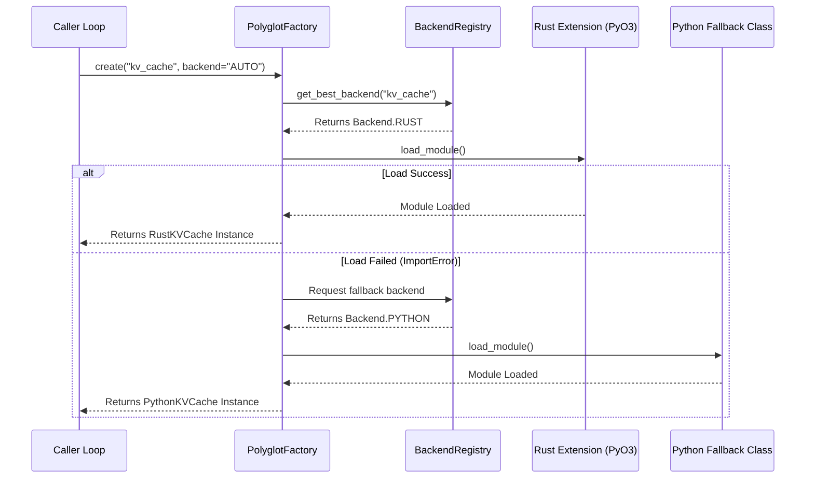

# 🔄 Polyglot Core Specification - Optimization Core

## 📋 Executive Summary

This document specifies the routing engine and memory bridge within `polyglot_core`. The module acts as an ultra-low-overhead abstraction layer, facilitating zero-copy memory transfers between Python memory structures and native heaps (Rust, C++, Go) while coordinating graceful runtime degradation fallbacks.

---

## 🎯 Primary Objectives

1.  **Asynchronous Orchestration**: Expose asynchronous adapters (`aput`, `aget`) that dispatch blocking native operations to executor threads, keeping the Python event loop active.
2.  **Adaptive Routing**: Automatically discover available compiled modules in the host environment and route execution to the fastest backend.
3.  **Zero-Copy Shared Buffers**: Interface with native memory layouts using Python's raw buffer protocol (`memoryview` or `bytes`) to eliminate data serialization:
    $$Serialization_{Overhead} \approx 0$$
4.  **Graceful Degradation Boundaries**: Implement transparent error boundaries that fallback to equivalent Python implementations if a compiled backend fails.
5.  **Observability Instrumentation**: Log FFI latency and record backend selection metrics.

---

## 🏗️ Architectural Topology

### Dynamic Backend Routing Flow



---

## 📦 Technical Specification

### Interface Definitions

```python
from enum import Enum
from typing import List, Optional, Dict, Any
from pydantic import BaseModel, Field
import logging
import sys
from optimization_core.core.exceptions import OptimizationCoreError

logger = logging.getLogger(__name__)

class PolyglotError(OptimizationCoreError):
    """Base exception for all polyglot FFI routing operations."""
    pass

class BackendNotAvailableError(PolyglotError):
    """Raised when the requested native module is not installed or fails to load."""
    pass

class ComponentCreationError(PolyglotError):
    """Raised when all backends (including fallbacks) fail initialization."""
    pass

class Backend(Enum):
    """Supported compilation and execution backends."""
    AUTO = "auto"
    RUST = "rust"
    CPP = "cpp"
    GO = "go"
    PYTHON = "python"  # Pure Python fallback
```

### Backend Discovery Registry

```python
class BackendInfo(BaseModel):
    """Metadata containing status and capabilities of a probed engine backend."""
    name: str = Field(..., description="Name of the backend.")
    available: bool = Field(..., description="Availability status.")
    version: Optional[str] = Field(default=None, description="Semantic version string.")
    capabilities: List[str] = Field(default_factory=list, description="Supported operations.")
    performance_score: float = Field(default=0.0, ge=0.0, le=1.0, description="Normalized scoring.")
    error_message: Optional[str] = Field(default=None, description="Import error diagnostic.")

class BackendRegistry:
    """Central registry for discovering and verifying compiler backends."""
    
    _cached_status: Dict[str, BackendInfo] = {}

    @classmethod
    def initialize_discovery(cls) -> None:
        """Probes the current environment to identify active compiler extensions."""
        cls._cached_status["rust"] = cls._probe_rust()
        cls._cached_status["cpp"] = cls._probe_cpp()
        cls._cached_status["go"] = cls._probe_go()
        cls._cached_status["python"] = BackendInfo(
            name="python",
            available=True,
            version=sys.version.split(" ")[0],
            capabilities=["kv_cache", "compression", "attention", "inference"],
            performance_score=0.1
        )

    @staticmethod
    def _probe_rust() -> BackendInfo:
        try:
            import truthgpt_rust
            version = getattr(truthgpt_rust, "__version__", "1.1.0")
            return BackendInfo(
                name="rust",
                available=True,
                version=version,
                capabilities=["kv_cache", "compression", "tokenization"],
                performance_score=0.95
            )
        except ImportError as err:
            return BackendInfo(
                name="rust",
                available=False,
                error_message=str(err),
                performance_score=0.0
            )

    @staticmethod
    def _probe_cpp() -> BackendInfo:
        try:
            import _cpp_core
            version = getattr(_cpp_core, "__version__", "1.1.0")
            return BackendInfo(
                name="cpp",
                available=True,
                version=version,
                capabilities=["attention", "cuda_kernels", "inference"],
                performance_score=0.98
            )
        except ImportError as err:
            return BackendInfo(
                name="cpp",
                available=False,
                error_message=str(err),
                performance_score=0.0
            )

    @staticmethod
    def _probe_go() -> BackendInfo:
        # Go usually operates over RPC/gRPC or CGO bridges
        return BackendInfo(
            name="go",
            available=False,
            error_message="Go RPC servers are not probed during initialization",
            performance_score=0.0
        )

    @classmethod
    def get_status(cls, backend: Backend) -> BackendInfo:
        if not cls._cached_status:
            cls.initialize_discovery()
        return cls._cached_status.get(backend.value, BackendInfo(name=backend.value, available=False))

    @classmethod
    def is_available(cls, backend: Backend) -> bool:
        return cls.get_status(backend).available
```

### Component Factory Routing Matrix

```python
FEATURE_ROUTING_TABLE = {
    "kv_cache": [Backend.RUST, Backend.CPP, Backend.PYTHON],
    "compression": [Backend.RUST, Backend.CPP, Backend.PYTHON],
    "attention": [Backend.CPP, Backend.RUST, Backend.PYTHON],
    "tokenization": [Backend.RUST, Backend.PYTHON],
}

class PolyglotFactory:
    """Instantiates the optimal cross-language component based on environmental availability."""
    
    @classmethod
    def get_best_backend(cls, feature: str) -> Backend:
        if feature not in FEATURE_ROUTING_TABLE:
            raise ValueError(f"Feature '{feature}' is not defined in the routing configuration table.")
            
        preferred_backends = FEATURE_ROUTING_TABLE[feature]
        for backend in preferred_backends:
            if BackendRegistry.is_available(backend):
                return backend
                
        logger.warning(f"No compiled backend found for feature: {feature}. Falling back to Python.")
        return Backend.PYTHON

    @classmethod
    def create_kv_cache(cls, max_size: int = 8192, backend: Backend = Backend.AUTO, **kwargs: Any) -> Any:
        target_backend = cls.get_best_backend("kv_cache") if backend == Backend.AUTO else backend
        
        if target_backend == Backend.RUST:
            from rust_core import PyKVCache
            return PyKVCache(max_size=max_size, **kwargs)
        elif target_backend == Backend.CPP:
            from cpp_core import CppKVCache
            return CppKVCache(max_size=max_size, **kwargs)
        else:
            from polyglot_core.fallbacks.cache import PythonKVCache
            return PythonKVCache(max_size=max_size, **kwargs)

    @classmethod
    def create_attention(cls, d_model: int, n_heads: int, backend: Backend = Backend.AUTO, **kwargs: Any) -> Any:
        target_backend = cls.get_best_backend("attention") if backend == Backend.AUTO else backend
        
        if target_backend == Backend.CPP:
            from cpp_core import FlashAttention
            return FlashAttention(d_model=d_model, n_heads=n_heads, **kwargs)
        else:
            from polyglot_core.fallbacks.attention import PythonAttention
            return PythonAttention(d_model=d_model, n_heads=n_heads, **kwargs)
```

### Asynchronous Polyglot Wrapper

```python
class UnifiedKVCache:
    """High-level facade for Key-Value Cache operations.
    
    Bridges FFI calls using zero-copy memoryviews and offloads heavy writes
    to background threads to prevent blocking the event loop.
    """
    
    def __init__(self, max_size: int = 8192, backend: Backend = Backend.AUTO, **kwargs: Any) -> None:
        self._impl = PolyglotFactory.create_kv_cache(max_size=max_size, backend=backend, **kwargs)
        self.active_backend = backend if backend != Backend.AUTO else PolyglotFactory.get_best_backend("kv_cache")
        
    def put(self, layer_idx: int, position: int, data: memoryview) -> None:
        """Stores data into cache using a zero-copy memoryview.

        Args:
            layer_idx: Target transformer layer index.
            position: Token index position in sequence.
            data: Buffer pointer.
        """
        self._impl.put(layer_idx, position, data)
        
    async def aput(self, layer_idx: int, position: int, data: memoryview) -> None:
        """Asynchronously stores data into the cache, releasing the event loop.

        Args:
            layer_idx: Target transformer layer index.
            position: Token index position.
            data: Buffer pointer.
        """
        loop = asyncio.get_running_loop()
        await loop.run_in_executor(None, lambda: self._impl.put(layer_idx, position, data))
        
    def get(self, layer_idx: int, position: int) -> Optional[memoryview]:
        """Retrieves cached activation data.

        Args:
            layer_idx: Target transformer layer index.
            position: Token index position.

        Returns:
            A zero-copy memoryview pointing to the cached buffer, or None if missing.
        """
        return self._impl.get(layer_idx, position)

    def get_telemetry(self) -> Dict[str, Any]:
        stats = self._impl.get_stats() if hasattr(self._impl, "get_stats") else {}
        stats["backend"] = self.active_backend.value
        return stats
```

---

## 🧪 Integration Verification

Verify fallback capabilities when compiled native modules fail to load:

```python
import pytest
from unittest.mock import patch
from optimization_core.polyglot import UnifiedKVCache
from optimization_core.polyglot import Backend

def test_polyglot_fallback_chain_trigger():
    """Verify routing fallbacks when imports fail."""
    # Force ImportError on target extensions
    with patch("builtins.__import__") as mock_import:
        def import_side_effect(name, *args, **kwargs):
            if name in ("truthgpt_rust", "_cpp_core"):
                raise ImportError(f"Missing FFI module: {name}")
            return patch.stop
            
        mock_import.side_effect = import_side_effect
        
        # Instantiate cache facade
        cache = UnifiedKVCache(max_size=1024, backend=Backend.AUTO)
        
        # Validate that the active backend is Python
        assert cache.active_backend == Backend.PYTHON
```

---

**Specification Version**: 1.1.0  
**Last Updated**: March 2026  
**Architectural Scope**: FFI Bridge and Router Subsystem
